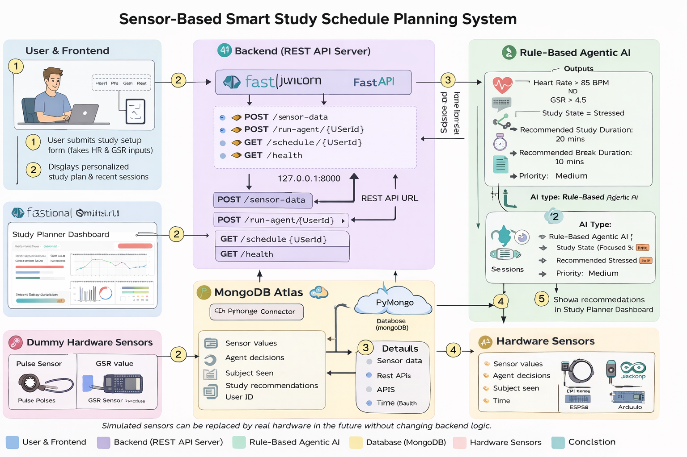

 # 📘 Sensor-Based Smart Study Schedule Planning System

## 📌 Project Overview
The **Sensor-Based Smart Study Schedule Planning System** is an intelligent web-based application that generates **personalized study schedules** by analyzing a student’s **stress level, focus, and fatigue** using simulated physiological sensor data.

The system uses a **Rule-Based Agentic AI** approach (not Machine Learning), making the decision process **transparent, explainable, and scalable** for future real-hardware integration.


------------------------------------------------------------------------------------------


## 1️⃣ Ideation & Research (Using AI Tools)

The idea for this project originated from the observation that students often study without considering:
- Stress level  
- Mental fatigue  
- Focus capacity  

This leads to low productivity and poor mental well-being.

### AI Tools Usage
AI tools were used during ideation and research to:
- Analyze common student productivity and burnout problems
- Understand physiological indicators such as:
  - Heart Rate (BPM)
  - GSR (Galvanic Skin Response)
- Select the most suitable AI approach  
  → **Agentic AI** was chosen instead of Machine Learning

### Outcomes from AI-Assisted Research
- Problem validation  
- Rule formulation for decision-making  
- Intelligent agent design  
- System architecture planning  


------------------------------------------------------------------------------------------


## 2️⃣ Business Model (Conceptual)

### 🎯 Target Users
- Students  
- Self-learners  
- Educational platforms  

### 💡 Value Proposition
- Smart and personalized study planning  
- Stress-aware study recommendations  
- Improved productivity and mental well-being  

### 🚀 Future Scope
- Integration with wearable devices  
- Premium analytics for institutions  
- Long-term personalized learning insights  


------------------------------------------------------------------------------------------


## 3️⃣ System Architecture Diagram (With Hardware + AI)

### 🧩 System Components
- **Frontend**: Web-based user interface (Next.js)  
- **Backend**: FastAPI server  
- **Agentic AI Engine**: Rule-based decision-making system  
- **Database**: MongoDB Atlas  
- **Hardware (Simulated)**: Heart Rate & GSR sensors  

### 🔄 Architecture Flow
               User
                ↓
        Frontend (Next.js)
                ↓
        Backend APIs (FastAPI)
                ↓
        Agentic AI (Rule-Based)
                ↓
        MongoDB Database
                ↓
        Frontend Dashboard


### 📷 Architecture Diagram


> Simulated sensors can be replaced by real hardware in the future without changing backend logic.


------------------------------------------------------------------------------------------


## 4️⃣ Technical Implementation Details

### 🔹 Frontend
- **Framework**: Next.js (React)

#### Responsibilities
- User authentication  
- Study setup form  
- Sensor data simulation  
- Displaying AI recommendations  
- Dashboard & recent study sessions  

---

### 🔹 Backend
- **Language**: Python  
- **Framework**: FastAPI  
- **Server**: Uvicorn  

#### Responsibilities
- Receive sensor and study data from frontend  
- Execute agentic AI logic  
- Store results in MongoDB  
- Expose REST APIs  

#### APIs Used
- `POST /sensor-data`  
- `POST /run-agent/{userId}`  
- `GET /schedule/{userId}`  
- `GET /health`  


------------------------------------------------------------------------------------------


## 5️⃣ Hardware Simulation Details

### 🧪 Current Implementation
- Real hardware is not connected yet  
- Sensor values are simulated in the frontend  

### 🔧 Simulated Sensors
- Heart Rate (BPM)  
- GSR (Stress indicator)  

### 🔮 Future Hardware Integration
- Pulse sensor / Smartwatch  
- GSR sensor module  
- ESP32 / Arduino  


------------------------------------------------------------------------------------------


## 6️⃣ Agentic AI Details

This project uses a **Rule-Based Agentic AI**.

### 🤖 Agent Capabilities

#### Observes
- Heart rate  
- GSR value  
- Subject strength  

#### Decides
- Study state (Focused / Fatigued / Stressed)  
- Recommended study duration  
- Recommended break duration  
- Priority level (Low / Medium / High)  

#### Acts
- Stores decisions in the database  
- Sends results to the frontend dashboard  

⚠️ still in progress


------------------------------------------------------------------------------------------


## 7️⃣ Database Details

- **Database**: MongoDB Atlas  
- **Type**: NoSQL (Document-based)  

### Stored Information
- User details  
- Subject data  
- Sensor readings  
- Agent decisions  
- Study recommendations  


------------------------------------------------------------------------------------------


## 8️⃣ Individual Contributions

- Frontend UI & dashboard development  
- Backend API development  
- Agentic AI rule design  
- Database schema planning  
- Integration and testing  

✔ Contributions are reflected through **meaningful GitHub commits**, including:
- Feature development  
- Bug fixes  
- Integration tasks  
- Documentation updates  


------------------------------------------------------------------------------------------


## 9️⃣ How to Run the Project

### ▶️ Backend
    ```bash
    cd backend
    venv\Scripts\activate
    uvicorn app.main:app --reload

### ▶️ Frontend
    npm install
    npm run dev


------------------------------------------------------------------------------------------


### 🔟 Technologies Used
    Next.js (React)

    FastAPI

    MongoDB Atlas

    Python

    Uvicorn

    Rule-Based Agentic AI


------------------------------------------------------------------------------------------


### 1️⃣1️⃣ Conclusion
    This project demonstrates a complete intelligent system integrating:
    Frontend
    Backend
    Database
    Agentic AI
    Hardware simulation

