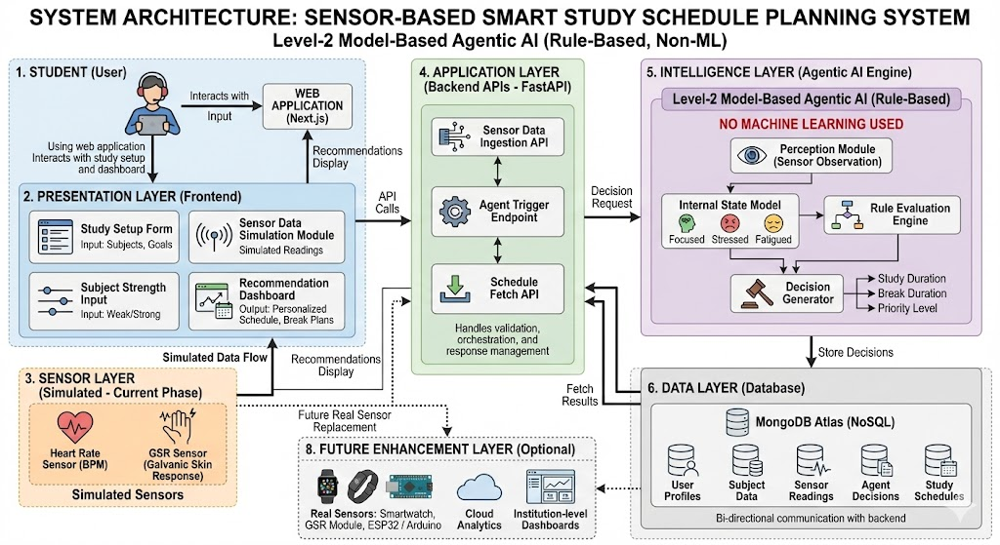

# 📘 Sensor-Based Smart Study Schedule Planning System

## 📌 Project Overview
The **Sensor-Based Smart Study Schedule Planning System** is an intelligent web-based application that generates **personalized study schedules** by analyzing a student’s **stress level, focus, and fatigue** using **simulated physiological sensor data**.

The system uses a **Rule-Based Agentic AI approach (Level-2: Model-Based Agent)** instead of Machine Learning, ensuring that decisions are **transparent, explainable, and easy to upgrade** when real hardware is introduced.

------------------------------------------------------------------------------------------

## 🎯 Problem Statement
Students often follow fixed study schedules without considering:
- Mental stress
- Fatigue
- Focus capacity

This leads to poor productivity and burnout.  
This system solves the problem by **adapting study plans dynamically** based on physiological conditions.

## 🧠 AI Approach Used
- **Agentic AI (Rule-Based)**
- **Agent Level**: **Level-2 – Model-Based Agent**
- No Machine Learning used

The agent:
- Observes sensor values
- Maintains internal state
- Applies predefined rules
- Takes autonomous decisions

------------------------------------------------------------------------------------------


## 1️⃣ Ideation & Research (Using AI Tools)

The idea for this project originated from the observation that students often study without considering:
- Stress level  
- Mental fatigue  
- Focus capacity  

This leads to low productivity and poor mental well-being.

AI tools were used for:
- Identifying student productivity issues
- Understanding physiological indicators:
  - Heart Rate (BPM)
  - GSR (Galvanic Skin Response)
- Selecting Agentic AI over ML

### Outcomes
- Problem validation
- Rule formulation
- Agent design
- System architecture planning


------------------------------------------------------------------------------------------


## 2️⃣ Business Model (Conceptual)

### 🎯 Target Users
- Students
- Self-learners
- Educational platforms

### 💡 Value Proposition
- Stress-aware study planning
- Personalized recommendations
- Improved productivity and mental well-being

### 🚀 Future Scope
- Wearable device integration
- Institutional analytics
- Long-term learning insights 


------------------------------------------------------------------------------------------


## 3️⃣ System Architecture

### 🧩 Components
- **Frontend**: Next.js (React)
- **Backend**: FastAPI (Python)
- **Agentic AI Engine**: Rule-Based Decision System
- **Database**: MongoDB Atlas
- **Sensors**: Simulated Heart Rate & GSR

### 🔄 Data Flow
               User
                ↓
        Frontend (Next.js)
                ↓
        Backend APIs (FastAPI)
                ↓
        Agentic AI Engine
                ↓
        MongoDB Database
                ↓
        Frontend Dashboard


### 📷 Architecture Diagram

 - PROPER


> Simulated sensors can be replaced by real hardware in the future without changing backend logic.


------------------------------------------------------------------------------------------


## 4️⃣ Technical Implementation Details

### 🔹 Frontend
- **Framework**: Next.js (React)

#### Responsibilities
- User authentication  
- Study setup form  
- Sensor data simulation  
- Displaying AI recommendations  
- Dashboard & recent study sessions  

---

### 🔹 Backend
- **Language**: Python  
- **Framework**: FastAPI  
- **Server**: Uvicorn  

#### Responsibilities
- Receive sensor and study data from frontend  
- Execute agentic AI logic  
- Store results in MongoDB  
- Expose REST APIs  

#### APIs Used
- `POST /sensor-data`  
- `POST /run-agent/{userId}`  
- `GET /schedule/{userId}`  
- `GET /health`  


------------------------------------------------------------------------------------------


## 5️⃣ Hardware Simulation Details

### 🧪 Current Implementation
- Real hardware is not connected yet  
- Sensor values are simulated in the frontend  

### 🔧 Simulated Sensors
- Heart Rate (BPM)  
- GSR (Stress indicator)  

### 🔮 Future Hardware Integration
- Pulse sensor / Smartwatch  
- GSR sensor module  
- ESP32 / Arduino  


------------------------------------------------------------------------------------------


## 6️⃣ Agentic AI Details

This project uses a **Rule-Based Agentic AI**.

### 🤖 Agent Capabilities

#### Observes
- Heart rate  
- GSR value  
- Subject strength  

#### Decides
- Study state (Focused / Fatigued / Stressed)  
- Recommended study duration  
- Recommended break duration  
- Priority level (Low / Medium / High)  

#### Acts
- Stores decisions in the database  
- Sends results to the frontend dashboard  


------------------------------------------------------------------------------------------


## 7️⃣ Database Details

- **Database**: MongoDB Atlas  
- **Type**: NoSQL (Document-based)  

### Stored Information
- User details  
- Subject data  
- Sensor readings  
- Agent decisions  
- Study recommendations  


------------------------------------------------------------------------------------------


## 8️⃣ Individual Contributions

- Frontend UI & dashboard development  
- Backend API development  
- Agentic AI rule design  
- Database schema planning  
- Integration and testing  

✔ Contributions are reflected through **meaningful GitHub commits**, including:
- Feature development  
- Bug fixes  
- Integration tasks  
- Documentation updates  


------------------------------------------------------------------------------------------


## 9️⃣ How to Run the Project

### ▶️ Backend
    ```bash
    cd backend
    venv\Scripts\activate
    uvicorn app.main:app --reload

### ▶️ Frontend
    npm install
    npm run dev


------------------------------------------------------------------------------------------


### 🔟 Technologies Used
    Next.js (React)

    FastAPI

    MongoDB Atlas

    Python

    Uvicorn

    MODEL BASED Agentic AI


------------------------------------------------------------------------------------------


### 1️⃣1️⃣ Conclusion
    This project demonstrates a complete intelligent system integrating:
    Frontend
    Backend
    Database
    Agentic AI
    Hardware simulation

### DEMO VIDEO - 
https://github.com/user-attachments/assets/4d752ca9-3ca6-4b43-b67e-c6fca618bd4e
