# 📘 Sensor-Based Smart Study Schedule Planning System

> **An adaptive, bio-feedback-driven study optimization platform powered by a Level-2 Model-Based Agentic AI.**

[](https://nextjs.org/)
[](https://react.dev/)
[](https://fastapi.tiangolo.com/)
[](https://python.org/)
[](https://www.mongodb.com/atlas)
[](https://www.typescriptlang.org/)
[](https://tailwindcss.com/)

---

## 📌 Executive Overview

Traditional study schedules are rigid, static, and disconnected from human physiology. Students frequently adhere to fixed timetables regardless of cognitive fatigue, elevated stress, or diminishing focus capacity, which often results in cognitive overload, burnout, and reduced learning retention.

The **Sensor-Based Smart Study Schedule Planning System** is an end-to-end intelligent platform that generates **dynamic, personalized study-break schedules** by continuously analyzing real-time and simulated physiological telemetry—specifically **Heart Rate (BPM)** and **Galvanic Skin Response (GSR)**.

Rather than relying on opaque, data-hungry black-box machine learning models, the core intelligence layer uses a **Rule-Based Agentic AI framework (Level-2: Model-Based & Utility-Based Agent)**. This ensures that every scheduling intervention is **deterministic, mathematically explainable, transparent, and hardware-agnostic**—making it seamlessly upgradable from simulated telemetry to physical wearable hardware (ESP32 / Pulse Sensor / GSR modules).

---

## 🎯 Core Value Proposition

- **Bio-Feedback Adaptive Scheduling**: Replaces static Pomodoro timers with dynamic intervals scaled to the student's live physiological stress and fatigue levels.
- **Explainable Agentic AI Engine**: Employs an internal state model, utility scoring function, and multi-objective optimization to balance immediate academic goals with mental health protection.
- **Subject-Aware Cognitive Memory**: Tracks historical stress trends across specific academic subjects to detect cumulative fatigue and adjust cognitive load.
- **Hardware-Ready Architecture**: Decoupled sensor ingestion pipeline allows instant switching between simulated telemetry and physical IoT biosensors.
- **Full-Stack Analytics Dashboard**: Real-time biometrics monitoring, session management, Recharts-powered telemetry trends, and actionable health insights.

---

## 🧠 Agentic AI Architecture (Level-2 Model-Based & Utility Agent)

The system’s decision engine is structured around the classical **Intelligent Agent Architecture** (Perception $\rightarrow$ Internal State $\rightarrow$ Utility Evaluation $\rightarrow$ Action):

```
       ┌────────────────────────────────────────────────────────┐
       │                 ENVIRONMENT (STUDENT)                  │
       │       Physiological Signals + Subject Task Load        │
       └──────────────────────────┬─────────────────────────────┘
                                  │
                       Percepts (HR, GSR, Subject)
                                  │
                                  ▼
       ┌────────────────────────────────────────────────────────┐
       │                   AGENTIC AI ENGINE                    │
       │                                                        │
       │  1. PERCEPTION & TREND MODEL                           │
       │     • Ingests Heart Rate (BPM) & GSR (μS)              │
       │     • Queries Subject Decision History (Memory)        │
       │     • Determines Stress Trend: Increasing/Decreasing   │
       │                                                        │
       │  2. INTERNAL STATE ESTIMATION                          │
       │     • Focused  : HR < 85 bpm, GSR < 3.0, Trend != Inc  │
       │     • Stressed : HR ≥ 85 bpm OR GSR ≥ 4.0              │
       │     • Fatigued : Intermediate / degraded states        │
       │                                                        │
       │  3. UTILITY FUNCTION & CANDIDATE SCORING               │
       │     • Utility = BaseStateScore + (Study/2) - (Break/2) │
       │                 ± TrendAdjustment                      │
       │     • Evaluates candidate (Study, Break) tuples        │
       │                                                        │
       │  4. MULTI-OBJECTIVE & LEARNING ADAPTATION              │
       │     • ProtectHealth : Restricts study, extends break   │
       │     • PushGoal      : Extends study when calm/focused  │
       │     • ReduceLoad    : Adjusts load if stress persists  │
       └──────────────────────────┬─────────────────────────────┘
                                  │
                    Action (Study/Break Interval)
                                  │
                                  ▼
       ┌────────────────────────────────────────────────────────┐
       │             DATABASE & DASHBOARD ACTUATION             │
       │    Stores Decision Memory & Renders Dynamic Schedule   │
       └────────────────────────────────────────────────────────┘
```

### 1. State Determination Rules
```python
if heart_rate < 85 and gsr < 3.0 and stress_trend != "Increasing":
    state = "Focused"
elif heart_rate >= 85 or gsr >= 4.0:
    state = "Stressed"
else:
    state = "Fatigued"
```

### 2. Utility Calculation Function
For each candidate schedule pair $(T_{\text{study}}, T_{\text{break}})$:
$$\text{Utility} = \text{Score}_{\text{base}}(\text{State}) + \left\lfloor\frac{T_{\text{study}}}{2}\right\rfloor - \left\lfloor\frac{T_{\text{break}}}{2}\right\rfloor + \Delta_{\text{trend}}$$

Where:
- $\text{Score}_{\text{base}}(\text{Focused}) = 50$, $\text{Score}_{\text{base}}(\text{Fatigued}) = 30$, $\text{Score}_{\text{base}}(\text{Stressed}) = 10$
- $\Delta_{\text{trend}} = -10$ if stress is *Increasing*, $+10$ if *Decreasing*, $0$ if *Stable*.

### 3. Multi-Objective Balancing (`balance_health_and_goal`)
- **`ProtectHealth`**: Triggered when stress trend is *Increasing*. Clamps maximum continuous study duration to 20 minutes and increases break intervals.
- **`PushGoal`**: Triggered when stress trend is *Decreasing* and daily study goal has not been reached. Safely boosts study interval by +10 minutes.
- **`Maintain`**: Preserves standard utility-optimal schedule.

---

## 🏗️ System Architecture & Data Flow

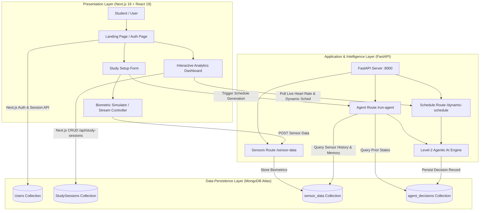
```mermaid
flowchart TD
    subgraph Client["Presentation Layer (Next.js 16 + React 19)"]
        A[Student / User] --> B[Landing Page / Auth Page]
        B --> C[Study Setup Form]
        B --> D[Interactive Analytics Dashboard]
        C --> E[Biometric Simulator / Stream Controller]
    end

    subgraph BackendLayer["Application & Intelligence Layer (FastAPI)"]
        F[FastAPI Server :8000]
        G[Sensors Route /sensor-data]
        H[Agent Route /run-agent]
        I[Schedule Route /dynamic-schedule]
        J[Level-2 Agentic AI Engine]
        
        F --> G
        F --> H
        F --> I
        H --> J
        I --> J
    end

    subgraph DataLayer["Data Persistence Layer (MongoDB Atlas)"]
        K[(Users Collection)]
        L[(StudySessions Collection)]
        M[(sensor_data Collection)]
        N[(agent_decisions Collection)]
    end

    E -->|POST Sensor Data| G
    C -->|Trigger Schedule Generation| H
    D -->|Poll Live Heart Rate & Dynamic Sched| I
    B -->|Next.js Auth & Session API| K
    D -->|Next.js CRUD /api/study-sessions| L

    G -->|Store Biometrics| M
    H -->|Query Sensor History & Memory| M
    H -->|Query Prior States| N
    J -->|Persist Decision Record| N
```

---

## 📸 Screenshots & Product Demo

### 🖥️ 1. Landing Page (Light & Dark Theme Modes)
| Light Mode Theme | Dark Mode Theme |
|---|---|
| 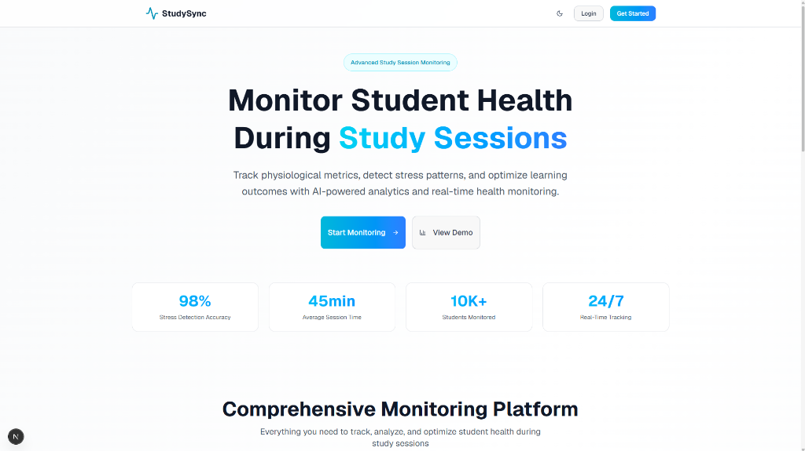 | 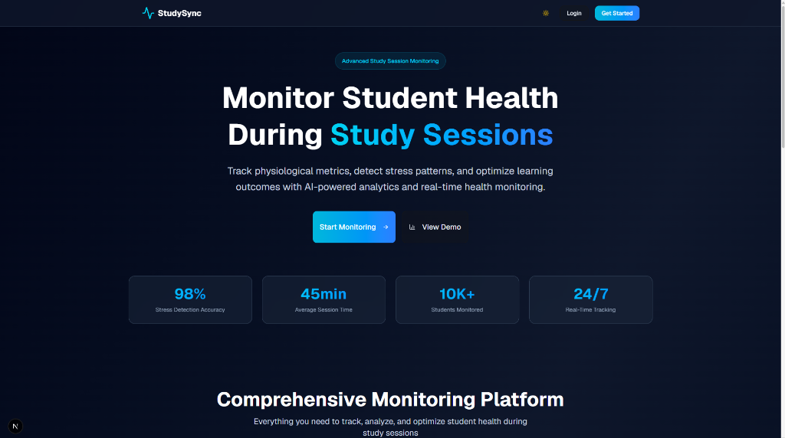 |

### 🔐 2. Student Authentication & Profile Portal
| Login & Registration Portal |
|:---:|
| 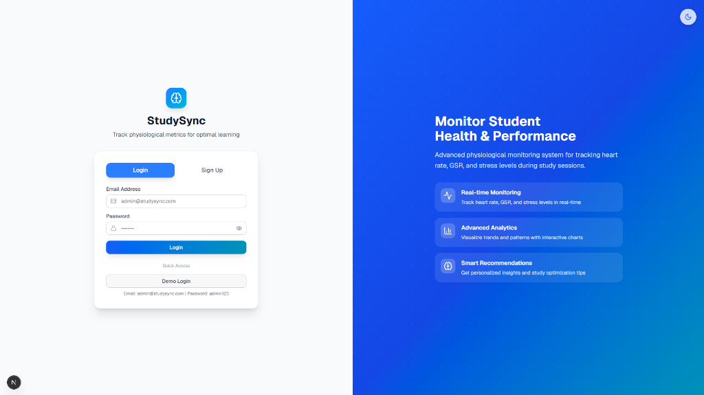 |
| *Secure student authentication interface supporting SHA-256 hashed credentials and quick demo access.* |

### 🎛️ 3. Multi-Subject Study Setup & Data Entry
| Study Queue & Goal Formulation |
|:---:|
| 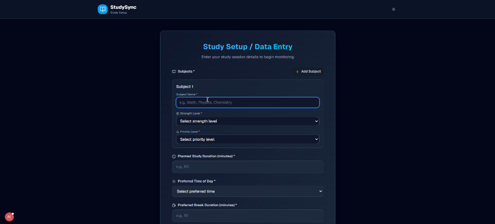 |
| *Dynamic study configuration queue specifying subjects, subject strength (Easy/Medium/Hard), priority levels, target study durations, and daily plans.* |

### 💓 4. Real-Time Telemetry & Adaptive Study Dashboard
| Live Biometrics & Adaptive Study Plan |
|:---:|
| 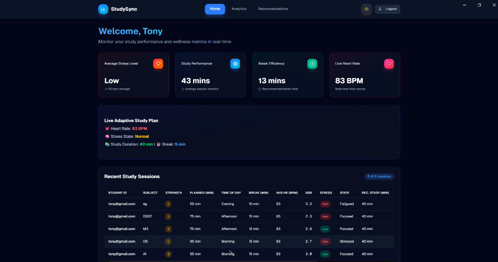 |
| *Live telemetry monitoring heart rate (83 BPM), stress states, real-time adaptive study intervals (40 min study / 5 min break), and session history.* |

### 📊 5. Advanced Analytics & Physiological Trends
| Cognitive & Physiological Session Analytics |
|:---:|
| 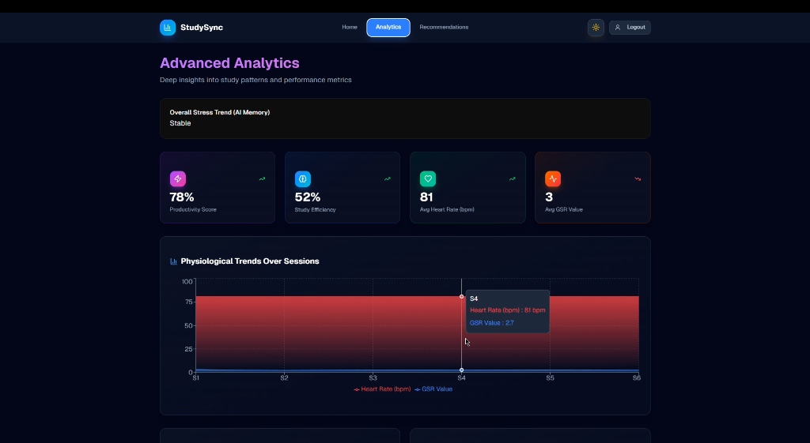 |
| *Interactive area charts plotting Heart Rate (BPM) and GSR ($\mu S$) trends across sessions, computing overall productivity scores (78%) and AI stress memory.* |

### 💡 6. Rule-Based AI Recommendations & Strategy
| AI-Driven Actionable Insights |
|:---:|
| 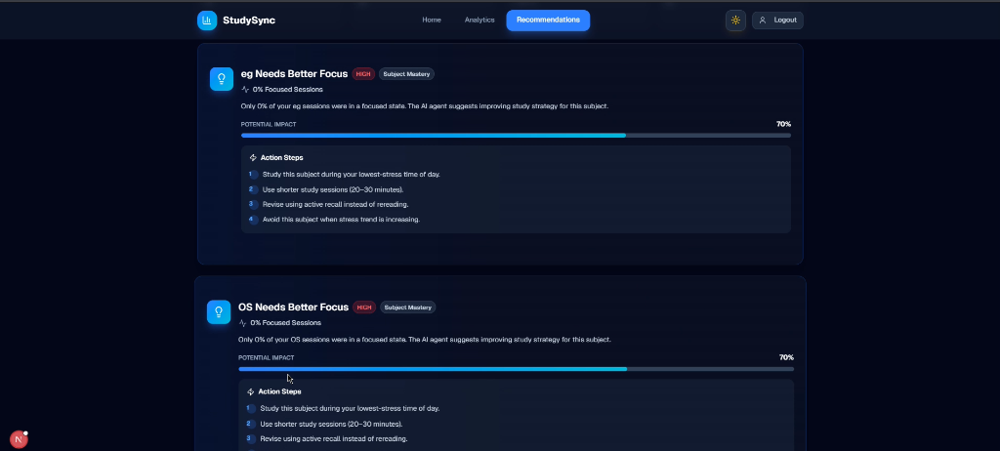 |
| *Personalized academic intervention plans with potential impact ratings, recommending optimal study times, shorter intervals, and active recall strategies.* |

### ⚙️ 7. Full-Stack Concurrent Execution Environment
| Dual Runtime Services (FastAPI + Next.js 16) |
|:---:|
| 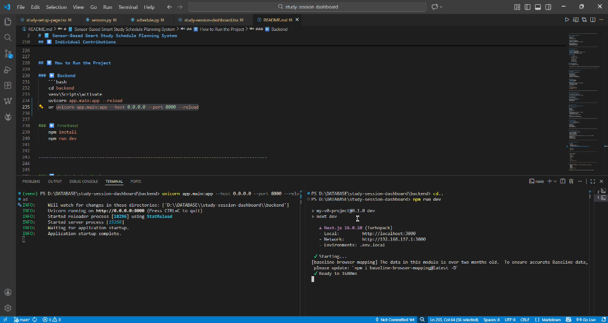 |
| *VS Code split-terminal displaying FastAPI Uvicorn ASGI server on port 8000 alongside Next.js 16 dev server on port 3000.* |

### 📡 8. Hardware IoT Biosensor Interfacing (ESP32 Live Stream)
| Physical ESP32 Pulse Sensor Ingestion |
|:---:|
| 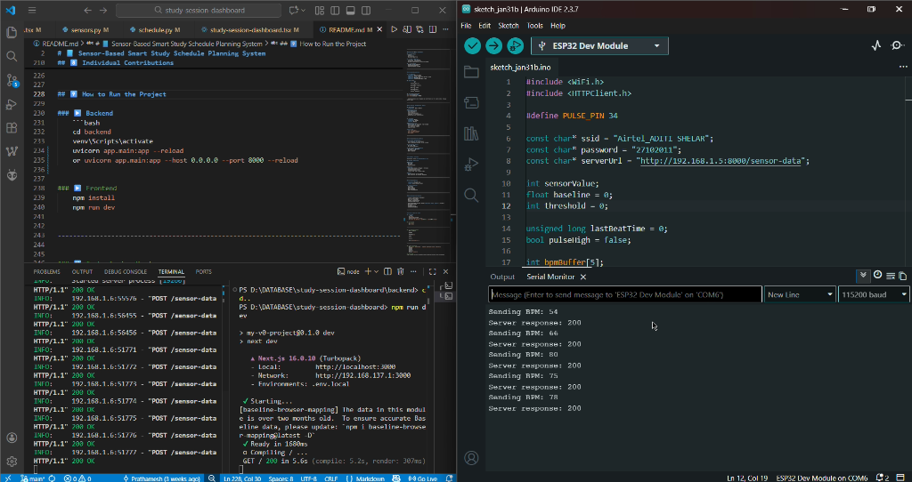 |
| *Live physiological telemetry transmission from an ESP32 micro-controller (`PULSE_PIN 34`) over WiFi directly to the FastAPI `/sensor-data` endpoint with instantaneous `200 OK` status logging.* |

### 🏗️ 9. System & Agentic AI Architecture
| Agent & System Architecture | Component & Data Flow |
|---|---|
| 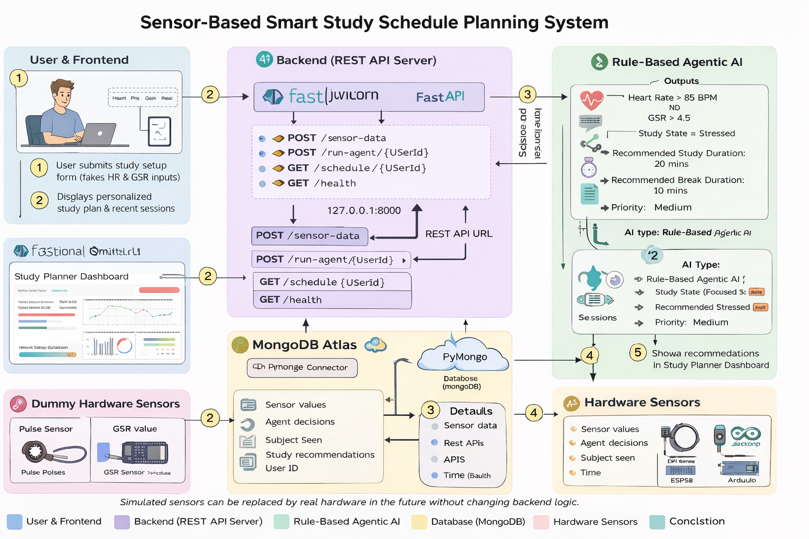 | 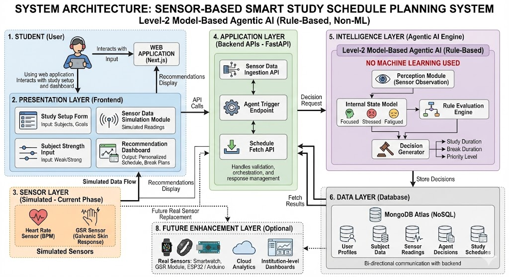 |

---

### 🎥 Live Demo Video
- **Local File**: [`screen-recording-2026-01-10-201100_wAztw0Cw.mp4`](screen-recording-2026-01-10-201100_wAztw0Cw.mp4)
- **GitHub Hosted Stream**: [Watch Full Platform Demo Video on GitHub Assets](https://github.com/user-attachments/assets/4d752ca9-3ca6-4b43-b67e-c6fca618bd4e)
- **Google Drive Video (HD Mirror)**: [Watch Full Video Demo on Google Drive ↗](https://drive.google.com/file/d/1-fjtxH8hDa0L-QGlDf35PF2yXRHTfPDc/view?usp=drive_link)

[](https://drive.google.com/file/d/1-fjtxH8hDa0L-QGlDf35PF2yXRHTfPDc/view?usp=drive_link)
<p align="center"><sub>▶️ <em>Click the preview image above to watch the complete live demo recording on Google Drive.</em></sub></p>

---

## ⚡ Key Features

### 🎛️ 1. Multi-Subject Study Setup
- Configurable study queue with custom subject names, strength levels (Easy, Medium, Hard), and priority rankings.
- Target study duration and daily study plan formulation.
- Automatic dispatch to the Agentic AI engine for multi-stage schedule generation.

### 💓 2. Real-Time Biometric Simulation & Ingestion
- Real-time physiological signal generator simulating **Heart Rate (BPM)** and **GSR ($\mu S$)**.
- Live polling mechanism (5-second telemetry cycle) to dynamically readjust active session timers if sudden stress spikes occur.
- Seamless interface for plugging in physical serial / HTTP IoT sensors.

### 📊 3. Analytical Study Dashboard
- **Session Summaries**: Active study tracking, total hours, average focus, and stress index distribution.
- **Interactive Visualizations**: Recharts-powered Radar Charts for cognitive strength, Area Charts for fatigue trends, Bar Charts for subject allocation, and Pie Charts for state distributions.
- **Actionable AI Recommendations**: Rule-derived interventions for time management, mental well-being, and scheduled review reminders.

### 🔐 4. Authentication & Session Persistence
- Secure SHA-256 password hashing with Mongoose schema validation.
- Dual-tier data strategy: Full remote MongoDB persistence with resilient browser `localStorage` fallback to support offline or disconnected environments.
- Complete CRUD capabilities for study logs and reviews.

---

## 🛠️ Technology Stack

| Layer | Technology | Description |
|---|---|---|
| **Frontend Framework** | **Next.js 16 (App Router)** | Server and client component rendering architecture |
| **UI Library** | **React 19** | Component-driven reactive user interface |
| **Language** | **TypeScript 5** & **Python 3.10+** | Strict type safety across frontend and backend |
| **Styling & Design** | **Tailwind CSS v4** | Modern responsive design with glassmorphism & dark/light modes |
| **UI Primitives** | **Radix UI** & **Lucide React** | Accessible dialogs, tabs, dropdowns, sliders, and icon sets |
| **Data Visualization** | **Recharts 2.15** | Interactive Area, Bar, Radar, and Pie telemetry charts |
| **Backend API** | **FastAPI 0.128** | Asynchronous, high-performance Python REST API framework |
| **ASGI Server** | **Uvicorn 0.40** | High-throughput asynchronous server gateway interface |
| **Database** | **MongoDB Atlas** | Cloud NoSQL document database |
| **Database Drivers** | **Mongoose 9.1** & **PyMongo 4.15** | Object modeling for Node.js and client driver for Python |
| **Validation** | **Pydantic 2.12** & **Zod 3.25** | Robust schema and runtime payload validation |

---

## 📂 Project Structure

```text
study-session-dashboard/
├── app/                               # Next.js App Router Pages & API Routes
│   ├── api/                           # Fullstack Next.js Backend Endpoints
│   │   ├── auth/                      # Authentication endpoints (login, register)
│   │   │   └── route.ts               # User auth handler with SHA-256 hashing
│   │   └── study-sessions/            # Session management API
│   │       ├── route.ts               # GET (list) & POST (create) sessions
│   │       └── [id]/route.ts          # GET, PUT, DELETE individual sessions
│   ├── dashboard/page.tsx             # Protected Study Analytics Dashboard page
│   ├── login/page.tsx                 # Authentication page (Login / Register)
│   ├── study-setup/page.tsx           # Multi-subject configuration page
│   ├── globals.css                    # Tailwind CSS v4 design system tokens
│   ├── layout.tsx                     # Root application layout & ThemeProvider
│   └── page.tsx                       # Landing page entrypoint
├── backend/                           # FastAPI Python Microservice
│   ├── app/                           # Backend Application Package
│   │   ├── agents/                    # Agentic AI Core Intelligence
│   │   │   └── study_agent.py         # Level-2 Model & Utility-Based Agent logic
│   │   ├── models/                    # Pydantic Request & Response Schemas
│   │   │   ├── agent_models.py        # Agent decision output schema
│   │   │   └── sensor_models.py       # Biometric sensor input schema
│   │   ├── routes/                    # API Endpoints
│   │   │   ├── agent.py               # /run-agent and /plan-day routes
│   │   │   ├── health.py              # /health status check
│   │   │   ├── schedule.py            # /schedule and /dynamic-schedule routes
│   │   │   └── sensors.py             # /sensor-data and /latest-heart-rate routes
│   │   ├── config.py                  # Environment variable configuration
│   │   ├── database.py                # PyMongo Atlas connection & collections
│   │   └── main.py                    # FastAPI entrypoint with CORS middleware
│   ├── requirements.txt               # Python package dependencies
│   └── .env                           # Backend environment variables
├── components/                        # React UI Components
│   ├── ui/                            # Reusable Radix UI component library
│   ├── landing-page.tsx               # Product landing page with feature cards
│   ├── login-page.tsx                 # Login & Registration component
│   ├── study-session-dashboard.tsx    # Primary telemetry & analytics dashboard
│   ├── study-setup-page.tsx           # Subject input and sensor dispatch form
│   └── theme-provider.tsx             # Next-themes dark/light context provider
├── docs/                              # Project Documentation Assets
│   └── screenshots/                   # Application & execution screenshots
│       ├── landing-light.png          # Landing page (Light theme)
│       ├── landing-dark.png           # Landing page (Dark theme)
│       ├── login-auth.png             # Student authentication portal
│       ├── study-setup-entry.png      # Study queue setup & data entry
│       ├── dashboard-live-telemetry.png # Real-time bio-telemetry dashboard
│       ├── advanced-analytics.png     # Session charts & physiological trends
│       ├── ai-recommendations.png     # AI actionable guidance & suggestions
│       ├── terminal-execution.png     # Fullstack dev services runtime
│       └── hardware-esp32-integration.png # Live ESP32 WiFi telemetry
├── lib/                               # Shared Utilities & Database Models
│   ├── db/
│   │   └── connect.ts                 # Mongoose cached connection utility
│   ├── models/
│   │   ├── StudySession.ts            # Mongoose StudySession schema
│   │   └── User.ts                    # Mongoose User schema
│   └── utils.ts                       # Class variance authority (CVA) helper
├── public/                            # Static assets and icons
├── scripts/                           # Database diagnostic scripts
│   └── test-mongo.js                  # MongoDB Atlas connection test runner
├── .env.local                         # Frontend local environment configuration
├── package.json                       # Node.js project manifest & scripts
├── tsconfig.json                      # TypeScript compiler configuration
└── README.md                          # Comprehensive project documentation
```

---

## 🗄️ Database Schemas & Data Models

### 1. MongoDB Collections Overview

| Collection | Managed By | Purpose | Key Fields |
|---|---|---|---|
| `users` | Next.js / Mongoose | Student authentication & profiles | `email`, `password` (SHA-256), `name`, `createdAt` |
| `studysessions` | Next.js / Mongoose | Study logs & performance records | `userId`, `subject`, `topic`, `duration`, `difficulty`, `effectiveness`, `status` |
| `sensor_data` | FastAPI / PyMongo | Raw & simulated biometric telemetry | `student_id`, `subject`, `subject_strength`, `heart_rate`, `gsr`, `timestamp` |
| `agent_decisions` | FastAPI / PyMongo | Historical AI agent state & choices | `student_id`, `subject`, `study_state`, `study_duration`, `break_duration`, `stress_trend`, `utility_score`, `timestamp` |

---

## 📡 API Reference

### FastAPI Backend Endpoints (Default: `http://localhost:8000`)

| Method | Endpoint | Description | Sample Request / Param |
|---|---|---|---|
| `GET` | `/health` | Service healthcheck | — |
| `POST` | `/sensor-data` | Ingest physiological sensor data | `{"student_id": "...", "subject": "Math", "subject_strength": 2, "heart_rate": 78, "gsr": 2.4}` |
| `GET` | `/latest-heart-rate/{student_id}` | Retrieve latest recorded heart rate | Path: `student_id` |
| `POST` | `/run-agent/{student_id}/{subject}` | Execute Level-2 Agent to compute optimal schedule | Path: `student_id`, `subject` |
| `POST` | `/plan-day/{student_id}` | Generate multi-session daily study plan | Path: `student_id`, Query: `daily_goal=120` |
| `GET` | `/schedule/{student_id}` | Retrieve all agent decision history | Path: `student_id` |
| `GET` | `/dynamic-schedule/{student_id}` | Live dynamic schedule based on current telemetry | Path: `student_id` |

### Next.js API Routes (Default: `http://localhost:3000`)

| Method | Endpoint | Description | Sample Payload |
|---|---|---|---|
| `POST` | `/api/auth?action=register` | Create a new student account | `{"name": "...", "email": "...", "password": "..."}` |
| `POST` | `/api/auth?action=login` | Authenticate user credentials | `{"email": "...", "password": "..."}` |
| `GET` | `/api/study-sessions?userId={id}` | Get all study sessions for a user | Query: `userId` |
| `POST` | `/api/study-sessions` | Create a new study session entry | `{"userId": "...", "subject": "...", "topic": "...", "duration": 45, "difficulty": "Medium"}` |
| `GET` | `/api/study-sessions/{id}` | Fetch specific session details | Path: `id` |
| `PUT` | `/api/study-sessions/{id}` | Update session status / duration | `{"status": "Completed", "effectiveness": 8}` |
| `DELETE` | `/api/study-sessions/{id}` | Delete a study session | Path: `id` |

---

## 🚀 Installation & Setup Guide

### 📋 Prerequisites
- **Node.js**: v18.18.0 or higher
- **Python**: v3.10 or higher
- **Package Manager**: `npm` or `pnpm`
- **MongoDB Atlas Cluster**: Free M0 Sandbox cluster or local MongoDB instance

---

### 1️⃣ Clone the Repository

```bash
git clone https://github.com/Prathamcoder3000/study-session-dashboard.git
cd study-session-dashboard
```

---

### 2️⃣ Configure Environment Variables

Create `.env.local` in the **root directory** (for Next.js):
```env
MONGODB_URI=mongodb+srv://<username>:<password>@<cluster-url>/study_session_db?retryWrites=true&w=majority
NODE_ENV=development
```

Create `.env` inside the `backend/` directory (for FastAPI):
```env
MONGODB_URI=mongodb+srv://<username>:<password>@<cluster-url>/?retryWrites=true&w=majority
```

---

### 3️⃣ Backend Setup (FastAPI)

Open a terminal and run:

```bash
# Navigate to backend directory
cd backend

# Create a virtual environment
python -m venv venv

# Activate virtual environment
# On Windows (PowerShell):
.\venv\Scripts\Activate.ps1
# On Windows (Command Prompt):
.\venv\Scripts\activate.bat
# On macOS/Linux:
source venv/bin/activate

# Install dependencies
pip install -r requirements.txt

# Start the FastAPI server
uvicorn app.main:app --host 0.0.0.0 --port 8000 --reload
```

The backend will be running at: `http://localhost:8000`  
Interactive Swagger API documentation: `http://localhost:8000/docs`

---

### 4️⃣ Frontend Setup (Next.js)

Open a **separate terminal** at the project root:

```bash
# Install Node dependencies
npm install

# Run the development server
npm run dev
```

The frontend will be running at: `http://localhost:3000`

---

## 💻 Complete User Workflow

```
 1. Landing Page (/)
    │
    ├──> View feature overview & value proposition
    └──> Click "Get Started" or "View Demo"
          │
 2. Authentication (/login)
    │
    ├──> Register a new student account (SHA-256 hashed & stored in MongoDB)
    └──> Log in to establish local and database session
          │
 3. Study Setup Form (/study-setup)
    │
    ├──> Enter subjects, difficulty/strength, and target study duration
    ├──> Biometric telemetry is simulated (or ingested from IoT hardware)
    ├──> Sensor data sent to FastAPI -> Level-2 Agent executes utility scoring
    └──> Optimized schedule returned & saved to memory
          │
 4. Analytics Dashboard (/dashboard)
    │
    ├──> Live Heart Rate & Stress monitor updates dynamically (5s polling)
    ├──> Dynamic study/break timers adjust to live physiological changes
    ├──> Interactive Recharts display stress patterns & performance metrics
    └──> Actionable health recommendations & schedule review booking
```

---

## 🧪 Hardware Integration (IoT Extension)

While the repository includes a built-in simulation layer, the architecture is ready for physical hardware integration without altering backend logic:

```
┌─────────────────────────┐          HTTP POST /sensor-data
│   ESP32 / Arduino Uno   │ ──────────────────────────────────────────┐
│                         │   JSON: {student_id, heart_rate, gsr...}  │
│  • Pulse Sensor (BPM)   │                                           ▼
│  • GSR Sensor (Stress)  │                                   ┌────────────────┐
└─────────────────────────┘                                   │ FastAPI Server │
                                                              └────────────────┘
```

- **Microcontroller**: ESP32 / ESP8266 / Arduino WiFi
- **Sensors**: Analog Pulse Sensor (Finger/Ear clip), Grove GSR Sensor (Galvanic Skin Response)
- **Protocol**: Periodic HTTP `POST` payloads sent directly to `http://<server-ip>:8000/sensor-data`

---

## 🔮 Future Roadmap

- [ ] **Hardware BLE / Web Serial Support**: Direct browser pairing with smartwatches and Bluetooth heart rate straps.
- [ ] **Reinforcement Learning (RL) Upgrade**: Transitioning from Level-2 Rule/Utility Agent to a Level-5 Learning Agent that optimizes schedule utilities using Q-Learning.
- [ ] **Voice-Assisted Focus Mode**: Audio prompts when extreme stress or fatigue is detected to trigger breathing exercises.
- [ ] **Institutional & Educator Portal**: Aggregate stress and burnout telemetry dashboards for academic counselors and teachers.

---

## 🤝 Contributing

Contributions are welcome! Follow these steps:

1. **Fork the Repository**
2. **Create a Feature Branch**: `git checkout -b feature/AmazingFeature`
3. **Commit Your Changes**: `git commit -m "Add AmazingFeature"`
4. **Push to Branch**: `git push origin feature/AmazingFeature`
5. **Open a Pull Request**

---

## 👤 Author & Maintainer

- **Prathamesh Shelar**
  - **GitHub**: [@Prathamcoder3000](https://github.com/Prathamcoder3000)
  - **Repository**: [study-session-dashboard](https://github.com/Prathamcoder3000/study-session-dashboard)

---

<div align="center">
  <sub>Built with ❤️ using Next.js, FastAPI, MongoDB Atlas, and Agentic AI.</sub>
</div>
